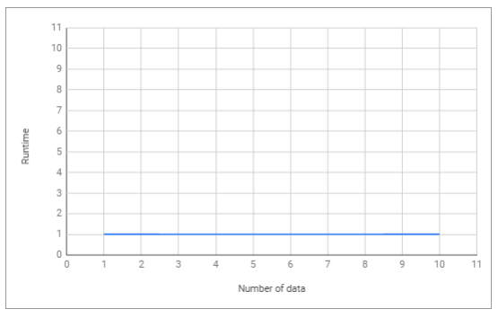

<h2 align="center"><b>Time Complexity dan Big-O Notation</b></h2>
<br>

Setiap programmer yang baik akan menggunakan cara yang paling efektif dan efisien dalam menyelesaikan suatu permasalahan. Dan untuk bisa melakukan hal tersebut, kita harus bisa meminimalisir kompleksitas dari algoritma yang kita gunakan.<br>

Kompleksitas suatu algoritma dibagi menjadi 2, yaitu __Time Complexity__ dan __Space Complexity__.
1. __Time Complexity__ adalah seberapa lama waktu yang diperlukan untuk menjalankan suatu algoritma.
2. __Space Complexity__ adalah seberapa besar memori yang kita gunakan untuk menjalankan suatu algoritma. Dan disini kita hanya akan membahas tentang Time Complexity.

***
__Time Complexity Analysis__ adalah suatu cara sederhana untuk mengetahui berapa lama waktu yang dibutuhkan untuk menjalankan suatu algoritma dengan input tertentu (n). Biasanya lebih dikenal dengan sebutan __Big-O Notation__. Big O Notation digunakan untuk mengukur tingkat kompleksitas suatu algoritma.<br>

__Big-O Notation adalah__ cara untuk mengkonversi keseluruhan langkah-langkah suatu algoritma kedalam bentuk Aljabar, yaitu dengan menghiraukan konstanta yang lebih kecil dan koefisien yang tidak berdampak besar terhadap keseluruhan kompleksitas permasalahan yang diselesaikan oleh algoritma tersebut.

```
Regular       Big-O
2             O(1)   --> It's just a constant number
2n + 10       O(n)   --> n has the largest effect
5n^2          O(n^2) --> n^2 has the largest effect
```

Sederhananya, semua contoh yang ada diatas mengatakan bahwa __“kita hanya akan melihat faktor yang memiliki dampak paling besar terhadap nilai yang dihasilkan oleh algoritma tersebut”__.

Terdapat beberapa macam time complexity, diantaranya:

* __O(1) — Constant Time__<br>
__Constant Time artinya__ banyaknya input yang diberikan kepada sebuah algoritma, tidak akan mempengaruhi waktu proses (runtime) dari algoritma tersebut.

```
let myArray = [1, 5, 0, 6, 1, 9, 9, 2];
function getFirst(input){
   return input[0]; // selalu melakukan 1 langkah
}
let firstEl = getFirst(myArray);
```

Contoh diatas, terdapat sebuah fungsi untuk mengambil elemen pertama dari sebuah input array. Kita bisa melihat bahwa berapapun jumlah array yang diberikan kepada fungsi tersebut, dia akan selalu melakukan 1 hal, yaitu mengambil elemen pertama. Itu artinya jumlah input yang diberikan tidak mempengaruhi waktu proses _(runtime)_ dari algoritma tersebut.

<p align="center"></p>
<p align="center">Constant Time></p>


* __O(log n) — Logarithmic Time__<br>
__Logarithmic Time artinya__ ketika kita memberikan input sebesar n terhadap sebuah fungsi, jumlah tahapan yang dilakukan oleh fungsi tersebut berkurang berdasarkan suatu faktor. Salah satu contohnya adalah algoritma Binary Search. __Binary Search__ adalah algoritma yang kita gunakan dalam mencari posisi nilai dari suatu array dengan cara ‘mengeliminasi’ setengah dari array input untuk mempercepat proses pencarian.

```
let sortedArray = [11, 24, 30, 43, 51, 61, 73, 86];
function isExists(number, array){
    var midPoint = Math.floor( array.length /2 );
    if( array[midPoint] === num) return true;
    let isFirstHalf = false;
    if( array[midPoint] < num ) isFirstHalf = true;
  
    else if( array[midpoint] > num ) isFirstHalf = false;
    if (array.length == 1) return false;
    else { 
        // memanggil fungsi yang sama dengan mengeleminiasi setengah dari input array
        if (isFirstHalf) 
            return isExists(number, getFirstHalf(array));
        else 
            return isExists(number, getSecondHalf(array));
    }
}
isExists (24, sortedArray); // return true
isExists (27, sortedArray); // return false
```
> Note: Fungsi rekursif biasanya Logarithmic

* __O(n) — Linear Time__<br>
Linear Time adalah ketika runtime dari fungsi kita berbanding lurus dengan jumlah input yang diberikan.

```
let myArray = [1, 5, 0, 6, 1, 9, 9, 2];
function getMax(input){
    var max = 0;
    for (var i=0; i<input.length; i++){
        if (max < input[i])
            max = input[i];
    }
    return max;
}
let maxNumber = getMax(myArray);
```

Kita bisa melihat bahwa semakin banyak jumlah input yang diberikan, __maka waktu proses/runtime dari fungsi tersebut akan semakin besar.__

<p align="center"></p>
<p align="center">Linear Time></p>

* __O(n²) — Quadratic Time__<br>
Quadratic Time adalah ketika runtime dari fungsi kita adalah sebesar n^2, dimana n adalah jumlah input dari fungsi tersebut. Hal tersebut bisa terjadi karena kita menjalankan __fungsi linear didalam fungsi linear (n*n)__.

```
let myArray = [1, 5, 0, 6, 1, 9, 9, 2];
function sort(input){
    var sortedArray = [];
    for (var i=0; i<input.length; i++){ // O(n)
        let min = input[i];
        for (var j=i+1; i<input.length; i++){ // O(n)
            if (input[i] < input[j])
                min = input[j];
        }
        sortedArray.push(min);
    }
    return sortedArray;
}
let sortedArray = sort(myArray);
```

<p align="center"></p>
<p align="center">Quadratic Time></p>


* __O(2^n) — Exponential Time__<br>
Exponential Time biasanya digunakan dalam situasi dimana kita tidak terlalu tahu terhadap permasalahan yang dihadapi, sehingga mengharuskan kita mencoba setiap kombinasi dan permutasi dari semua kemungkinan.

***
## KESIMPULAN<br>
Sebagai programmer, kita sering kali dihadapkan dengan adanya beberapa solusi untuk sebuah permasalahan dan kita dibingungkan dengan pertanyaan __“mana solusi yang lebih efisien?”__.

Dengan memahami __Big-O Notation__, kita akan lebih mudah dalam melihat mana algoritma yang lebih efisien yang bisa kita gunakan untuk menyelesaikan permasalahan yang sedang dihadapi.